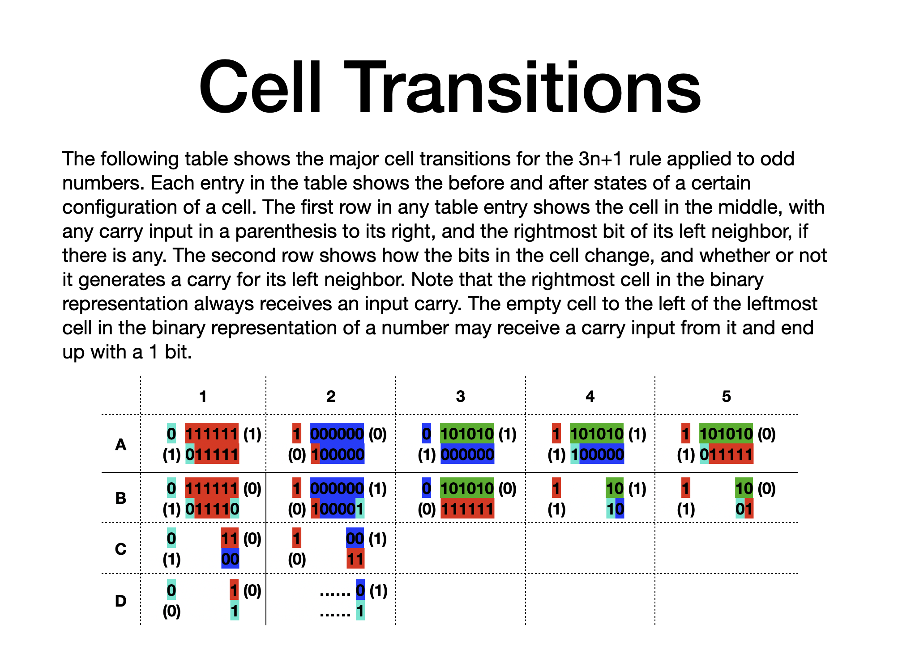

  

# About
In the summer of 2021, I spent two months consumed by the Collatz conjecture. I examined binary and ternary representations of numbers as they were transformed by Collatz rules, and started noticing interesting patterns. Any randomly selected binary number may look like a random sequence of 0s and 1s, but it can always be segmented into smaller chunks (which I call "cells") that have a more regular structure. I identified three cell types: ALL_ONES, ALL_ZEROS, and ALT_01S ([please see the PDF file](CollatzConjecture.pdf)). Any binary number can be uniquely segmented from right (LSB) to left (MSB), one cell at a time. I color-coded these cells, studied and tabulated their transitions, developed an ipynb notebook for simulating and visualizing their transitions, and documented the patterns I observed. 

I didn't find a proof, but I showed that one type of cells (blue) has advantages over another type (red) that seem to tilt the balance of the opposite forces that shrink and expand the bit sequence towards shrinkage--creating an overall attraction that drives any number down to 1. I didn't arrive at a formal proof, and I don't have the mathematical chops for it, so I stopped in late summer 2021.

I believe my approach may offer a new lens on Collatz. As a computer engineer, I think in terms of systems of interacting state machines. But while I have a background in formal verification of such systems, I am not a mathematician, and don't have the expertise and the right tools to take this work further.

Given today’s LLMs and AI-assisted coding/proofs, I wondered if feeding my 2021 notes into such systems could help formalize the idea. Still, AI-assisted proofs need an expert at the helm. I'm releasing this work in the hope it sparks interest--especially among researchers using AI-assisted proof systems. Can such systems interpret my visual, not-very-formal approach, translate it into the right mathematical objects, and make headway? If you try, I’d love to hear from you.
